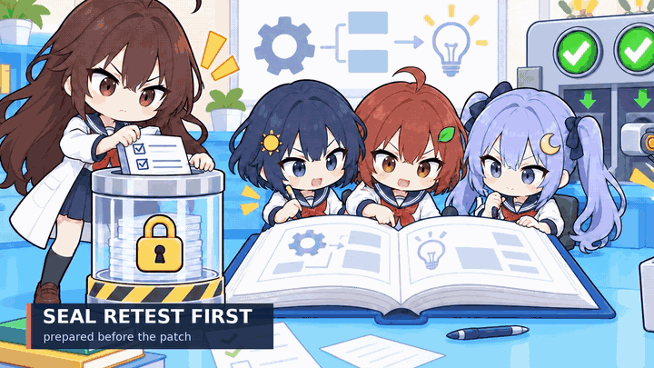

# A Skill That Improves Your Skill

[English](README.md) · [繁體中文](README.zh-TW.md)


`skill-generalizer` is a meta-skill for improving another skill across multiple models. A teacher model creates behavioral scenarios, observes fresh target models, proposes one evidence-backed change, and ships it only if a sealed retest passes for every target without regression.

It does not assume that weaker models simply need longer instructions. It tests behavior first.

## How it works

```text
freeze expectations and a sealed retest
→ let fresh models use the unchanged skill
→ grade observable behavior, not self-reports
→ turn one repeated failure into one small lesson
→ compare source and candidate on fresh retest runs
→ publish one common skill, or reject the patch
```



[Watch the higher-quality 10-second MP4](assets/teacher-student-loop.mp4).

The teacher writes the complete diagnostic, contrast, and retest packet before any student answers exist. A small fixed regression set supports comparisons across versions; newly generated sealed cases make case-specific memorization harder. See [scenario design](references/scenario-design.md).

## What gets published

The output is one concise common `SKILL.md`—not separate prompts for Sol, Terra, and Luna. The public skill preserves the original intent and includes only the smallest lessons that passed every target.

Model names, questions, scores, failed candidates, and grading stay in a separate evidence bundle. If a candidate fails one target or regresses elsewhere, the source skill remains the published version. See the [common skill output example](references/common-skill-output-example.md).

## Current pilot

The [teacher–student pilot](experiment-v3-teacher/README.md) used fresh Sol, Terra, and Luna agents at low reasoning. A repeated diagnostic gap suggested one rule: final reports should contain a distinct changed-files list.

| Model | Diagnostic source | Retest source | Retest candidate | Target behavior |
|---|---:|---:|---:|---|
| Sol | 6/6 | 5/6 | 6/6 | fail → pass |
| Terra | 5/6 | 5/6 | 6/6 | fail → pass |
| Luna | 5/6 | 5/6 | 4/6 | fail → fail |
| **Total** | **16/18** | **15/18** | **16/18** | **0/3 → 2/3** |

The candidate improved the target behavior, but Luna still missed it and regressed on another item. The candidate is therefore **unvalidated**, not fitted. This negative result is useful: the retest gate prevented an intuitive but unreliable patch from shipping.

This pilot has one answer per model and item, one task family, and no repeated draws. It demonstrates the workflow and its rejection mechanism—not stable differences between model families or universal improvement.

## Try the skill

Clone the repository into your Codex skills directory:

```bash
git clone git@github.com:CuteOwOwO/skill-improves-skill.git ~/.codex/skills/skill-generalizer
```

Then ask Codex something like:

```text
Use $skill-generalizer to test this skill across Sol, Terra, and Luna.
Keep one common skill and show me the evidence for every retained change.
```

The workflow needs fresh target-model runs to claim a fit. Without them, it can prepare the evaluation packet and candidate lesson, but must label results as pending or unvalidated.

## Acceptance rule

A candidate is accepted only when:

- every requested target passes the repaired behavior;
- no previously passing behavior regresses;
- the retest was sealed before the patch was written;
- grading uses observable criteria defined before execution.

A higher average score cannot hide a target failure.

## Repository map

```text
SKILL.md                           teacher–student generalization workflow
references/scenario-design.md     generated and fixed case protocol
references/common-skill-output-example.md
                                   shape of a publishable common skill
experiment-v3-teacher/            latest pilot and raw evidence
experiment-v2/                    earlier behavior-fit experiment
benchmark/                        retained density pilot
results/                          earlier raw runs and audit trail
assets/                           README artwork and visual provenance
```

The [fit specification](references/fit-spec.md) and [micro-adjustment rules](references/micro-adjustments.md) retain the heavier-weight experimental protocol.

## Validate

Validate the skill package:

```bash
python3 /path/to/skill-creator/scripts/quick_validate.py .
```

Grade an answer file against the retained benchmark:

```bash
python3 benchmark/grade.py path/to/answers.json benchmark/calibration-key.json
```

## Visual notes

The artwork brief is available in [English](ILLUSTRATION-BRIEF.en.md) and [繁體中文](ILLUSTRATION-BRIEF.md). Generation and motion provenance are recorded in [assets/VISUAL-LINEAGE.md](assets/VISUAL-LINEAGE.md).
